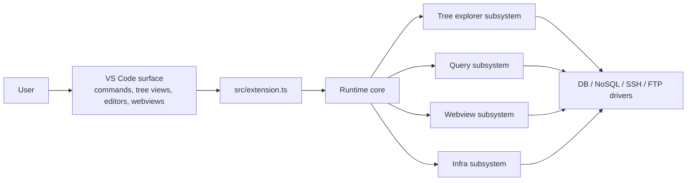
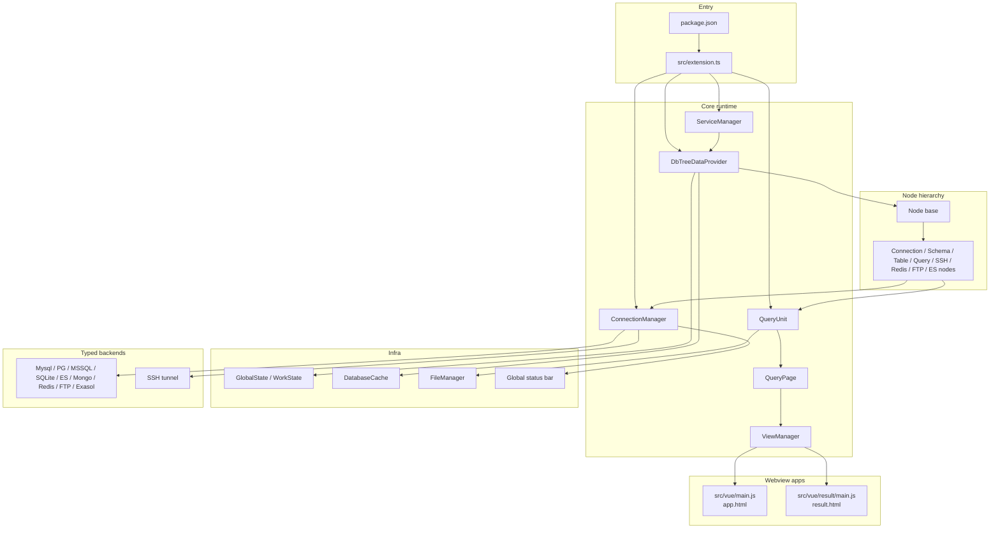
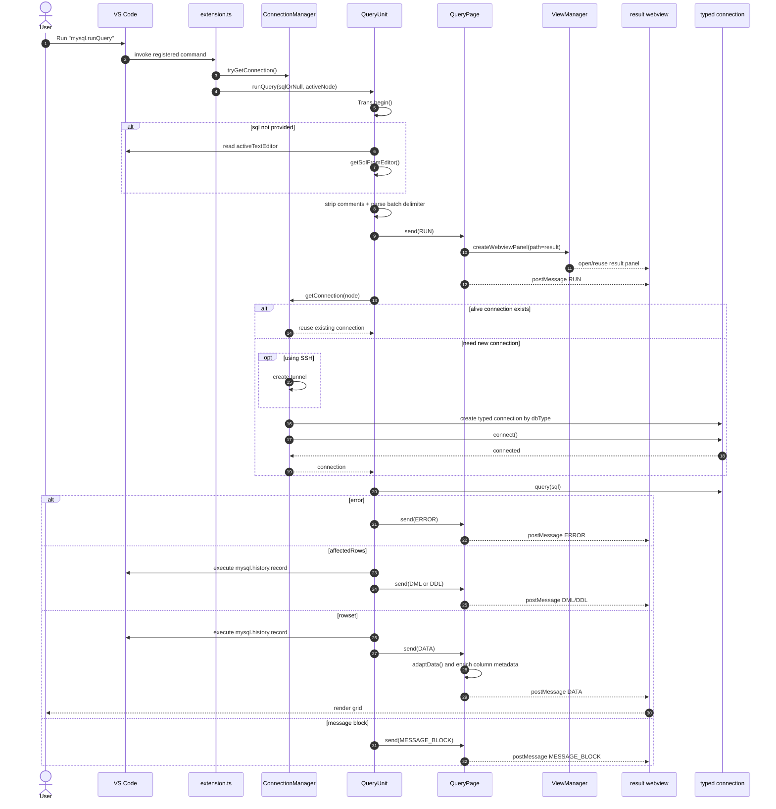
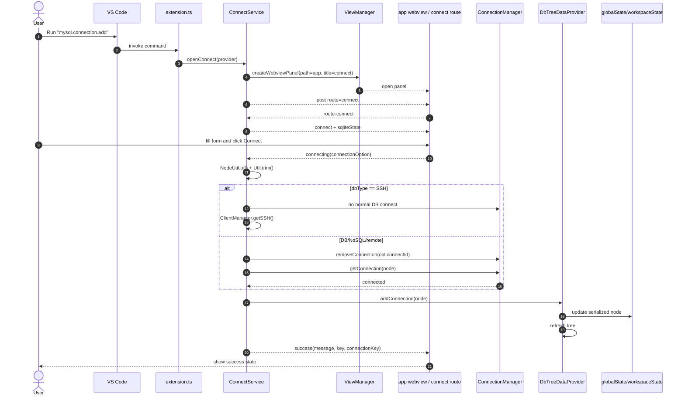
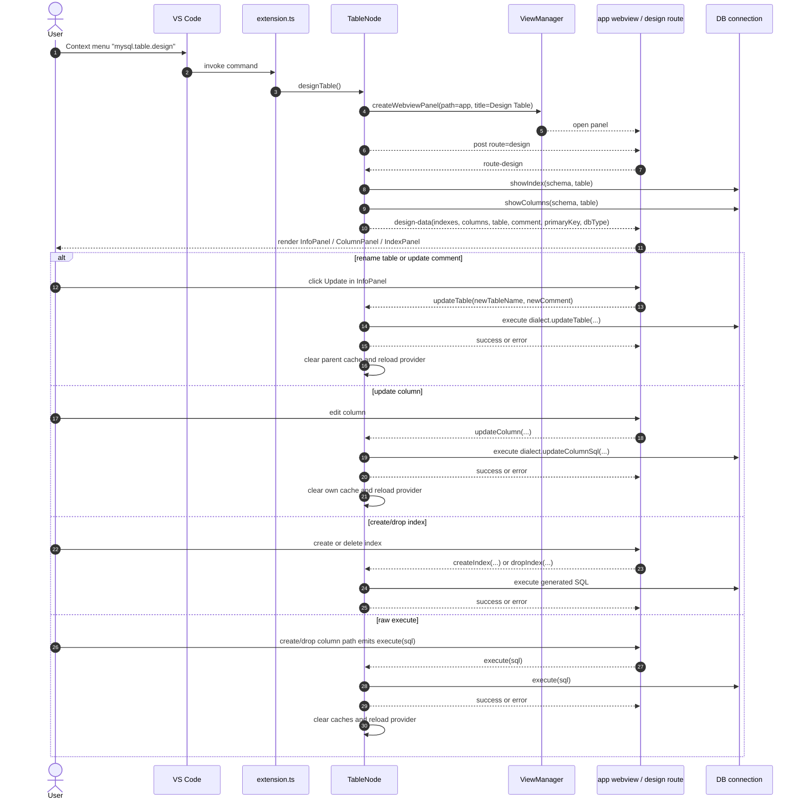

# Architecture

This document is the consolidated architecture reference for the current extension. It does not propose a refactor; it describes the runtime architecture that exists today.

## Document Map

- [diagram.md](diagram.md): quick overview diagrams
- [deep-dive-query.md](deep-dive-query.md): query pipeline
- [deep-dive-tree-explorer.md](deep-dive-tree-explorer.md): explorer and node system
- [deep-dive-webview-app.md](deep-dive-webview-app.md): webview shell, router, and message bus

## 1. System Context

## 2. Design Summary

- This extension is a small application running inside VS Code, not just a language helper.
- `src/extension.ts` is the command registry and entry point, not the business layer.
- The `Node` layer is both a domain model and a UI model because `Node` extends `vscode.TreeItem`.
- `DbTreeDataProvider` hydrates serialized connection definitions from `globalState` and `workspaceState` into node objects.
- `ConnectionManager` owns active-node state, connection reuse, typed driver creation, and SSH tunneling.
- `QueryUnit` orchestrates query execution, while `QueryPage` is the backend adapter for the result webview.
- `ViewManager` is the shared webview shell for both `app.html` and `result.html`.

## 3. Module Boundaries

| Layer | Main files | Responsibility |
| --- | --- | --- |
| Surface | `package.json`, `src/extension.ts` | Activation events, command names, menus, VS Code registration |
| Composition root | `src/service/serviceManager.ts` | Initialize services, language providers, and tree views |
| Tree explorer | `src/provider/treeDataProvider.ts`, `src/model/**` | Build and refresh the explorer hierarchy |
| Query | `src/service/queryUnit.ts`, `src/service/result/query.ts`, `src/service/page/**` | Run SQL/ES/Mongo queries, adapt results, and drive the result UI |
| Connections | `src/service/connectionManager.ts`, `src/service/connect/**`, `src/service/tunnel/**` | Connection lifecycle, tunnels, and typed driver creation |
| Webview shell | `src/common/viewManager.ts`, `src/vue/**` | Open and reuse panels, route `app` pages, and host the result grid UI |
| Infra | `src/common/state.ts`, `src/common/filesManager.ts`, `src/service/common/databaseCache.ts`, `src/common/global.ts` | Persistence, cache, temp/query files, and status bar state |

## 4. Runtime Component Diagram

## 5. Key Invariants

### 5.1 Node identity drives several systems

- `Node.getConnectId()` is the key for connection reuse.
- `Node.uid` is the key for child cache, collapse state, and the in-memory node cache.
- `Node.cacheSelf()` makes it possible to find the same logical node again via `uid` or `connectId`.

### 5.2 Connection config is serialized, then hydrated

- Connection definitions are stored in `globalState` and `workspaceState`.
- When the tree renders, `DbTreeDataProvider.getConnectionNodes()` reads serialized objects.
- `getNode()` maps those objects into `ConnectionNode`, `EsConnectionNode`, `RedisConnectionNode`, `SSHConnectionNode`, `FTPConnectionNode`, or `ConnectionNode` for SQL and MongoDB roots.

### 5.3 The query UI is interactive, not passive

- The result view does not just render data.
- It calls back into the backend for `execute`, `next`, `count`, `export`, and `saveModify`.
- Because of that, the query subsystem and webview subsystem are tightly coupled.

### 5.4 `app.html` is a multi-route shell

- A single `app.html` serves `connect`, `status`, `design`, `structDiff`, `redisStatus`, `terminal`, `forward`, and `sshTerminal`.
- The actual route is controlled by the backend through the `route` event.

## 6. Sequence: `mysql.runQuery`

This sequence describes the editor-driven command path.

### Notes

- The command handler in `src/extension.ts` does not query directly; it delegates to `QueryUnit`.
- `QueryPage.send(RUN)` happens before the query returns so the result panel can enter a loading state.
- `QueryPage.adaptData()` contains DB-specific logic for ES, MongoDB, and SQL table metadata.

## 7. Sequence: `mysql.connection.add`

### Notes

- The connect form runs in a webview, but the final state still lives in `globalState` and `workspaceState`.
- `provider.addConnection()` is the point where the connection is actually persisted.
- `mysql.connection.edit` follows the same flow, except `openConnect()` preloads the node and carries `isGlobal`.

## 8. Sequence: `mysql.table.design`

### Notes

- The design page is an `app` route, not a standalone webview type.
- `TableNode.designTable()` is the backend controller for the entire page.
- The child Vue panels do not query directly; they emit events back to `TableNode`.

## 9. Ownership by Area

| Area | Primary owner in code |
| --- | --- |
| Command map | `src/extension.ts` |
| Tree hydration | `src/provider/treeDataProvider.ts` |
| Node identity and generic DB actions | `src/model/interface/node.ts` |
| Connection lifecycle | `src/service/connectionManager.ts` |
| Connect/edit config UI flow | `src/service/connect/connectService.ts` |
| Query orchestration | `src/service/queryUnit.ts` |
| Result adaptation and result webview backend | `src/service/result/query.ts` |
| Webview shell and reuse policy | `src/common/viewManager.ts` |
| App webview routing | `src/vue/main.js`, `src/vue/App.vue` |
| Result grid UI | `src/vue/result/App.vue` |

## 10. Hot Spots and Coupling

### Tight coupling

- `Node` is coupled to `vscode.TreeItem`, cache behavior, query execution, and terminal logic.
- `QueryPage` is coupled to the result webview protocol.
- `TableNode.designTable()` is coupled to SQL generation, execution, cache invalidation, and webview event handling.

### Hidden contracts

- `app.html` route protocol: the backend must emit `route`, and the frontend must emit `route-<name>`.
- `result.html` event contract: `RUN`, `DATA`, `NEXT_PAGE`, `COUNT`, `DML`, `ERROR`, and `MESSAGE`.
- Connection serialization contract: objects stored in state must be hydratable into valid `Node` subclasses.

## 11. Recommended Reading Order

1. `package.json`
2. `src/extension.ts`
3. `src/service/serviceManager.ts`
4. `src/provider/treeDataProvider.ts`
5. `src/model/interface/node.ts`
6. `src/service/connectionManager.ts`
7. `src/service/queryUnit.ts`
8. `src/service/result/query.ts`
9. `src/common/viewManager.ts`
10. `src/vue/main.js`
11. `src/vue/result/App.vue`

## 12. If You Need More Detail

- Query path: [deep-dive-query.md](deep-dive-query.md)
- Explorer path: [deep-dive-tree-explorer.md](deep-dive-tree-explorer.md)
- Webview path: [deep-dive-webview-app.md](deep-dive-webview-app.md)
