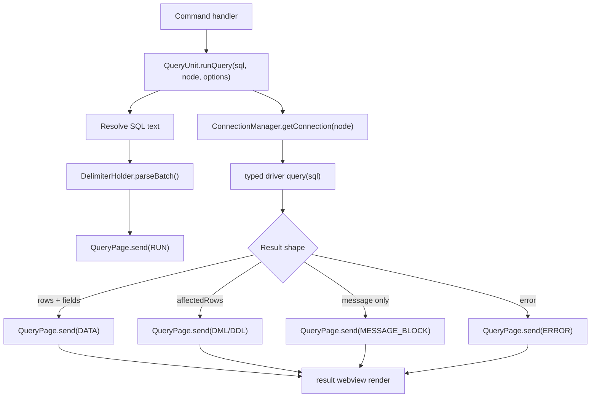
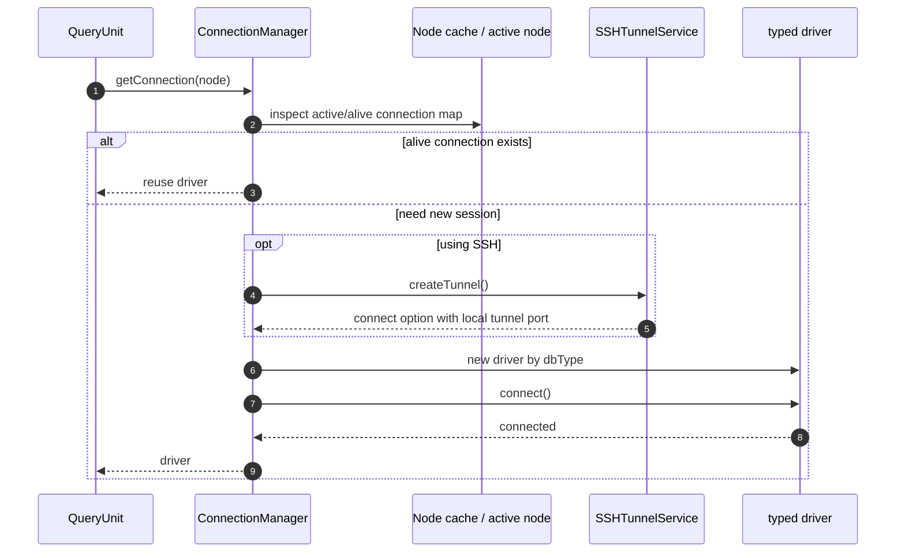
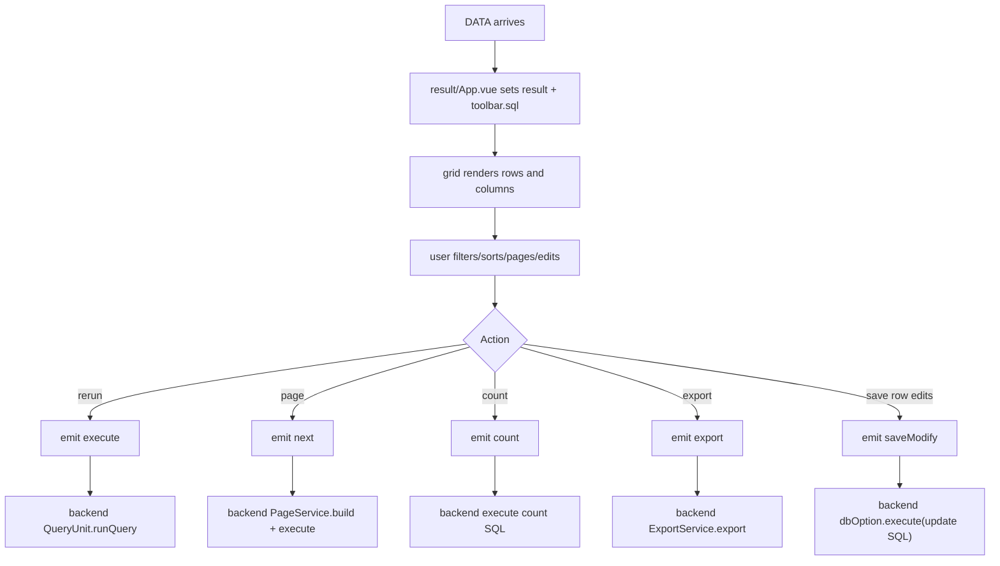

# Deep Dive: Query

This document goes deeper into the query pipeline: command -> connection -> result adaptation -> result webview.

## Main Files

| File | Role |
| --- | --- |
| `src/extension.ts` | maps `mysql.runQuery`, `mysql.runAllQuery`, and `mysql.codeLens.run` |
| `src/service/queryUnit.ts` | execution orchestration |
| `src/service/result/query.ts` | result adaptation and backend message handling for the result webview |
| `src/service/connectionManager.ts` | connection lookup, creation, and reuse |
| `src/service/page/**` | paging SQL builders per database type |
| `src/vue/result/App.vue` | result grid, paging, export, row editing, and rerun actions |

## 1. Query Entry Points

`QueryUnit.runQuery()` is called from multiple paths:

- `mysql.runQuery`
- `mysql.runAllQuery`
- `mysql.codeLens.run`
- `TableNode.openTable()`
- `TableNode.openInNew()`
- `QueryNode.run()`
- ES result actions inside `QueryPage`

Meaning:

- The query subsystem is not only for SQL editor commands.
- It is a shared runtime path for SQL, ES, MongoDB, and several tree-driven actions.

## 2. Execution Pipeline

## 3. `QueryUnit` Responsibilities

`QueryUnit` does five different jobs:

1. It reads SQL from the editor when the command does not provide SQL directly.
2. It handles delimiter and batch parsing.
3. It kicks off the loading state through `QueryPage.send(RUN)`.
4. It talks to `ConnectionManager`.
5. It classifies responses as `DATA`, `DML`, `DDL`, `MESSAGE_BLOCK`, or `ERROR`.

Because of that, `QueryUnit` is an orchestration layer, not a pure DB layer.

## 4. SQL Source Resolution

When `sql == null`, `QueryUnit.getSqlFromEditor()` resolves SQL in this order:

1. If `runAll == true`, read the entire document.
2. If the user has a selection, read the selection.
3. Otherwise, parse the current SQL block with `SQLParser.parseBlockSingle()`.

Implications:

- `mysql.runQuery` requires the active editor to be in the expected context.
- The active database is not attached directly to the file. It comes from `ConnectionManager.tryGetConnection()`.

## 5. Connection Resolution

Current driver selection:

- MySQL
- PostgreSQL
- SqlServer
- SQLite
- ElasticSearch
- MongoDB
- Redis
- FTP
- Exasol

## 6. Result Classification

`QueryUnit` classifies results based on the shape of `data` and `fields`:

- `data.affectedRows` -> `DML`
- valid rowset fields -> `DATA`
- MySQL procedure special case -> `DATA`
- everything else -> `MESSAGE_BLOCK`
- thrown or driver error -> `ERROR`

### Non-obvious cases

- An empty SQLite query can still be treated as `DATA` if `fields.length == 0` and the SQL is `select`.
- Empty Mongo queries have their own rule.
- MySQL stored procedures have a special branch that extracts the final rowset correctly.

## 7. `QueryPage` Responsibilities

`QueryPage.send()` does more than post messages. It also:

- normalizes `singlePage` and `viewId`
- decides whether to split the view
- enriches result metadata
- lazily loads column metadata for SQL tables
- opens or reuses the result webview
- registers backend handlers for paging, count, export, and `saveModify`

## 8. Result Enrichment

### SQL

`loadColumnList()` tries to locate the table from:

- parsed `from/join`
- `fields[0].orgTable`
- cached node lookup via `getByRegion(tableName)`

If it finds a `TableNode`, it enriches the response with:

- `primaryKey`
- `columnList`
- `primaryKeyList`
- `table`
- `tableCount`

### ElasticSearch

- determines `indexName`
- sets `_id` as `primaryKey`
- trims the leading metadata fields

### MongoDB

- parses `db('...').collection('...')`
- sets `_id` as `primaryKey`

## 9. Result Webview Contract

| Message | Direction | Meaning |
| --- | --- | --- |
| `RUN` | backend -> webview | enter loading state and update the SQL textbox |
| `DATA` | backend -> webview | render the result grid |
| `NEXT_PAGE` | backend -> webview | replace the current page of data |
| `COUNT` | backend -> webview | update the total count |
| `DML` / `DDL` | backend -> webview | show success info |
| `MESSAGE_BLOCK` | backend -> webview | show a success text block |
| `ERROR` | backend -> webview | show an error |
| `execute` | webview -> backend | rerun SQL |
| `next` | webview -> backend | request paging |
| `count` | webview -> backend | request total count |
| `export` | webview -> backend | export the current request |
| `saveModify` | webview -> backend | persist inline edits |

## 10. Result UI Loop

## 11. Paging Logic

Paging does not live in the frontend.

- The result webview emits `next(pageNum, pageSize, sql)`.
- The backend calls `ServiceManager.getPageService(dbType).build(...)`.
- The new SQL is executed through `dbOption.execute(sql)`.

Implications:

- Paging syntax is database-specific.
- The result view has to know `dbType`.

## 12. Inline Edit Loop

`src/vue/result/App.vue` supports row edits and saving:

1. The UI builds update SQL.
2. It emits `saveModify`.
3. The backend runs `dbOption.execute(sql)`.
4. On success, it emits `updateSuccess`.
5. The UI merges `editList` back into `result.data`.

This is a full backend/UI loop, not just "open result and stop".

## 13. Important Dependencies

- `ConnectionManager.tryGetConnection()` depends on the active editor and active node.
- `Node.getByRegion()` depends on `Node.nodeCache`.
- `Trans.begin()` and `transId` are used to distinguish new and stale requests in the UI.
- `FileManager.record()` is used when opening generated SQL template files.

## 14. Risks / Hot Spots

- The query path depends on a lot of UI context: active editor, active node, and webview state.
- `QueryPage` mixes data transformation and UI protocol logic, which makes it harder to test in isolation.
- `runQuery()` swallows the final exception with `console.log(error)` instead of propagating it.
- SQL result metadata depends on parser heuristics and `orgTable`, which is not always guaranteed.

## 15. Read This Area In Order

1. `src/service/queryUnit.ts`
2. `src/service/result/query.ts`
3. `src/service/connectionManager.ts`
4. `src/service/page/**`
5. `src/vue/result/App.vue`
