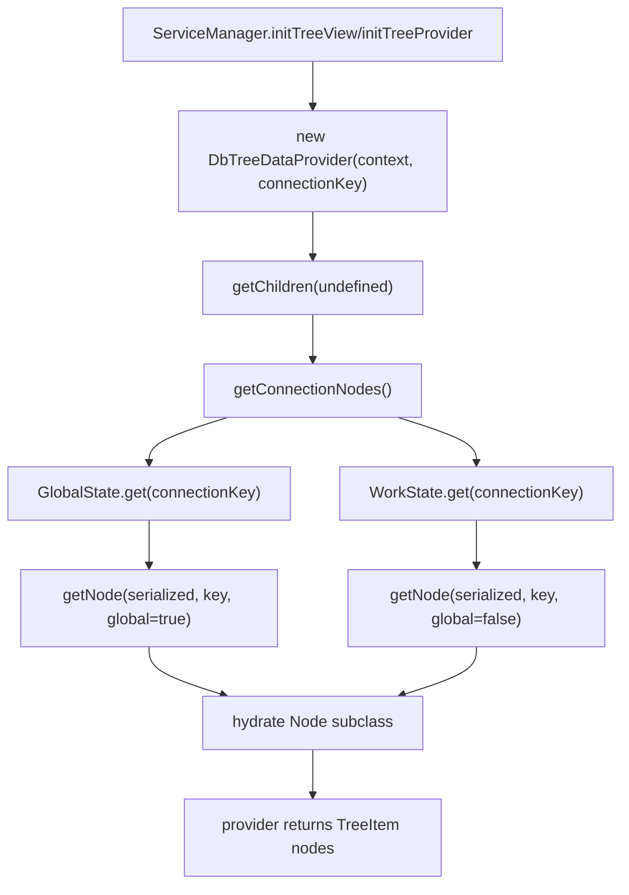
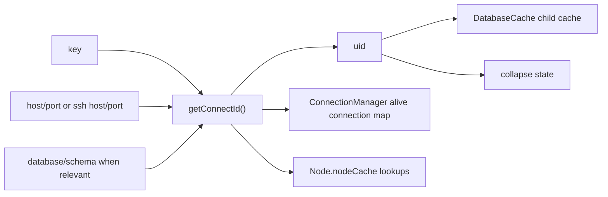
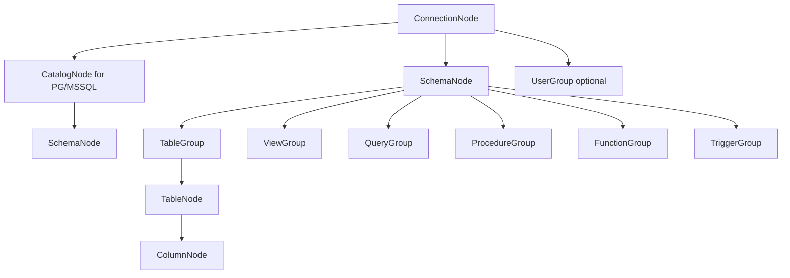
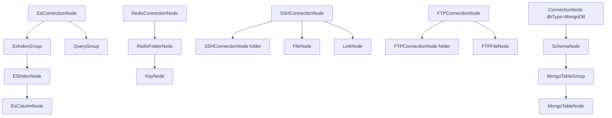
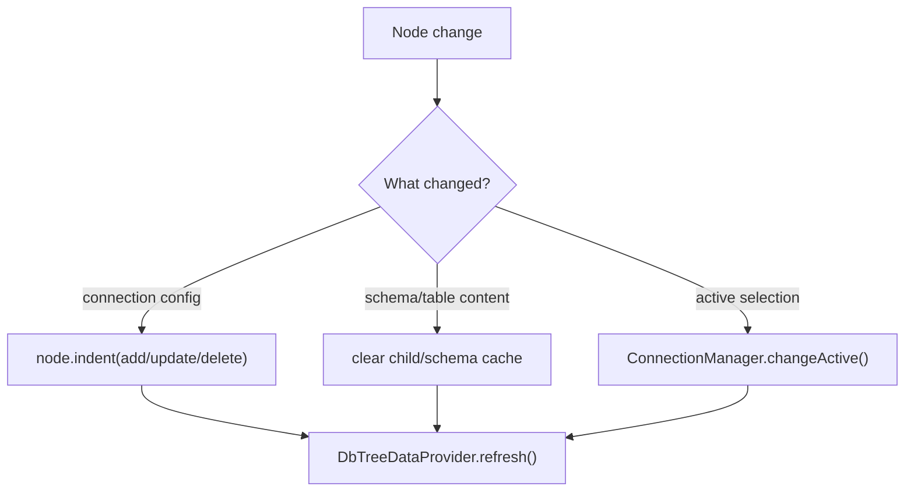
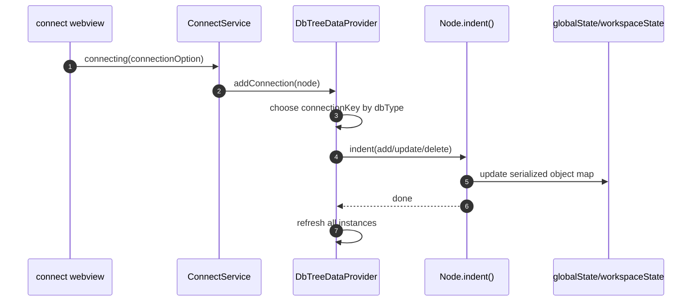
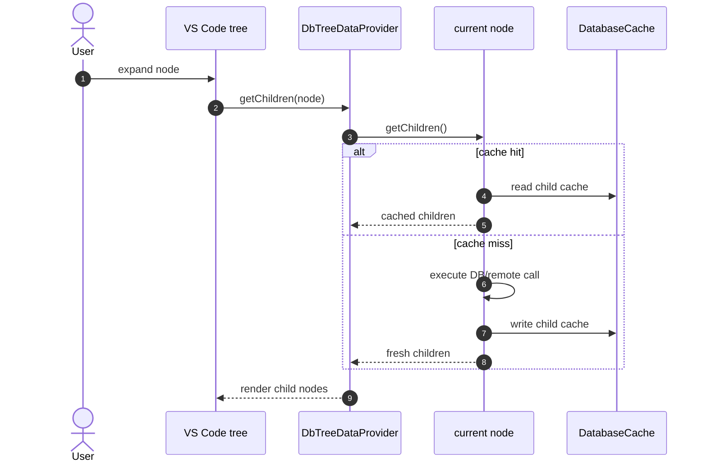

# Deep Dive: Tree Explorer

This document goes deeper into the explorer subsystem: connection serialization, node hydration, identity, cache, refresh behavior, and the SQL/NoSQL branch structure.

## Main Files

| File | Role |
| --- | --- |
| `src/service/serviceManager.ts` | creates the two tree views |
| `src/provider/treeDataProvider.ts` | hydrates and refreshes the node tree |
| `src/model/interface/node.ts` | base node identity, execution, and cache hooks |
| `src/service/common/databaseCache.ts` | child cache, schema cache, and collapse state |
| `src/common/state.ts` | `globalState` / `workspaceState` wrapper |
| `src/model/database/connectionNode.ts` | SQL-style root connection node |
| `src/model/database/schemaNode.ts` | schema/database level node |

## 1. Two Trees, One Provider Class

The extension creates two tree views:

- `github.cweijan.mysql`
- `github.cweijan.nosql`

Both use `DbTreeDataProvider`, but with different `connectionKey` values:

- `mysql.connections`
- `redis.connections`

## 2. Tree Hydration Flow

## 3. Which Class Gets Hydrated

`DbTreeDataProvider.getNode()` maps a serialized object into a class:

- `ES` -> `EsConnectionNode`
- `REDIS` -> `RedisConnectionNode`
- `SSH` -> `SSHConnectionNode`
- `FTP` -> `FTPConnectionNode`
- otherwise -> `ConnectionNode`

Important note:

- `MongoDB` currently goes through `ConnectionNode`; there is no dedicated `MongoConnectionNode` root class.
- From there, `SchemaNode` plus `MongoTableGroup` branches into the Mongo-specific subtree.

## 4. The Node Base Class Is the Backbone

`Node` in `src/model/interface/node.ts` does several jobs:

- extends `vscode.TreeItem`
- stores connection fields
- computes `uid`
- computes `connectId`
- executes queries through `execute()`
- caches itself through `cacheSelf()`
- exposes terminal integration

### Identity Rules

### Why It Matters

- A wrong `uid` means refresh and cache behavior will target the wrong node.
- A wrong `connectId` means connections may be reused incorrectly or active state may be lost.

## 5. SQL-style Explorer Branch

### Notes

- `ConnectionNode.getChildren()` loads the schema/database list and caches it in `DatabaseCache`.
- `SchemaNode.getChildren()` does not query the DB; it only creates group nodes based on settings.
- `TableGroup.getChildren()` is where the actual table list query runs.
- `TableNode.getChildren()` queries columns.

## 6. NoSQL and Remote Branch

## 7. Lazy Loading and Timeout Behavior

`DbTreeDataProvider.getChildren(element)` does the following:

1. Starts a timeout timer.
2. Awaits `element.getChildren()`.
3. If the timeout wins, returns `InfoNode("Connect time out!")`.
4. If the call finishes in time, assigns `parent` to each child and returns the list.

Implications:

- The tree layer has its timeout guard directly in the provider, not in the driver layer.
- If the request finishes after timeout, the provider calls `reload(element)` so the tree can try again.

## 8. Cache Layers

### 8.1 Persisted state

- Connection definitions: `globalState` + `workspaceState`
- Collapse state: persisted separately through `DatabaseCache.storeElementState()`

### 8.2 In-memory state

- `DatabaseCache.cache.database`: schema list per connection
- `DatabaseCache.childCache`: child list per node uid
- `Node.nodeCache`: lookup by `connectId` or `uid`
- `ConnectionManager.activeNode`

### 8.3 Refresh rules

## 9. Active Database / Active Connection

Explorer active state does not live in the tree provider.

- `ConnectionManager.activeNode` is the source of truth.
- `Global.updateStatusBarItems(activeNode)` updates the status bar text.
- When the active editor changes, `detectActive()` can reconstruct the node from a file path of the form `key@@host@port@db@schema`.

Implication:

- Query files in `globalStoragePath` carry active-connection metadata in the path itself.

## 10. Connection Persistence Flow

## 11. Typical Expand Flow

## 12. Hot Spots

- `Node` is an abstract base class, but it still owns a lot of concrete behavior.
- MongoDB reuses `ConnectionNode` as its root, which is easy to misread when scanning quickly.
- `DatabaseCache.storeElementState()` has separate global and workspace branches, which matters when debugging expand/collapse behavior.
- Refresh is broad: `DbTreeDataProvider.refresh()` fires for all provider instances.

## 13. Read This Area In Order

1. `src/provider/treeDataProvider.ts`
2. `src/model/interface/node.ts`
3. `src/service/common/databaseCache.ts`
4. `src/model/database/connectionNode.ts`
5. `src/model/database/schemaNode.ts`
6. `src/model/main/tableGroup.ts`
7. `src/model/main/tableNode.ts`
8. `src/model/es/model/esConnectionNode.ts`
9. `src/model/redis/redisConnectionNode.ts`
10. `src/model/ssh/sshConnectionNode.ts`
11. `src/model/ftp/ftpConnectionNode.ts`
