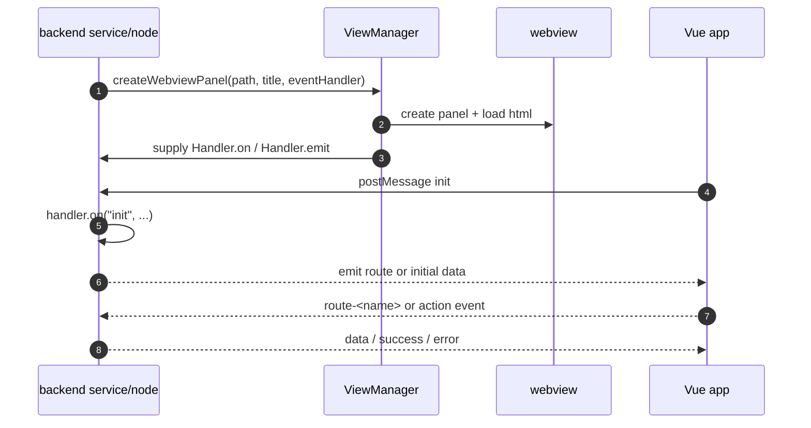
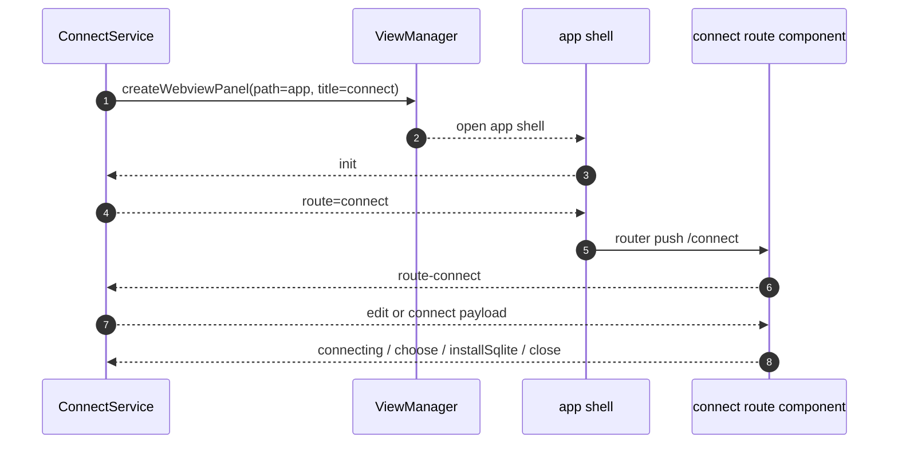
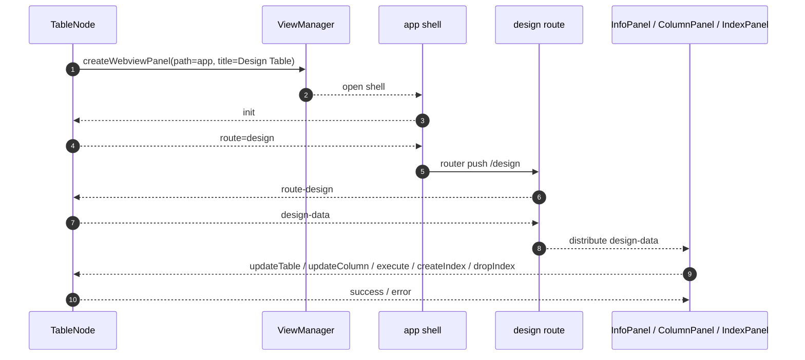
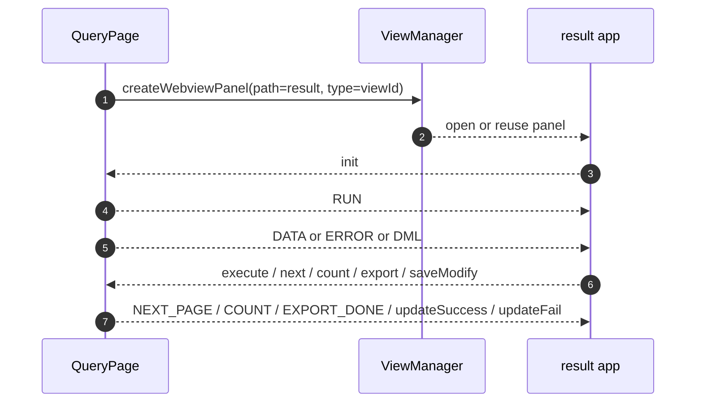

# Deep Dive: Webview App

This document goes deeper into the webview subsystem: `ViewManager`, `app.html`, `result.html`, the route handshake, and the event bus.

## Main Files

| File | Role |
| --- | --- |
| `src/common/viewManager.ts` | opens and reuses webview panels, wires message handlers |
| `src/vue/main.js` | Vue router for `app.html` |
| `src/vue/App.vue` | route handshake for the `app` shell |
| `src/vue/util/vscode.js` | thin wrapper around `acquireVsCodeApi()` |
| `src/vue/result/main.js` | bootstrap for `result.html` |
| `src/vue/result/App.vue` | result grid shell |

## 1. Two Webview Shells

The extension uses two webview shells.

### `app.html`

A routed shell used for multiple pages:

- `connect`
- `status`
- `design`
- `structDiff`
- `keyView`
- `terminal`
- `redisStatus`
- `forward`
- `sshTerminal`

### `result.html`

A dedicated shell for the result grid:

- SQL results
- ES results
- Mongo results
- paging
- export
- inline editing

## 2. `ViewManager` Responsibilities

`ViewManager.createWebviewPanel()` does four things:

1. Decides whether the panel is singleton or non-singleton through `singlePage`.
2. Loads the built HTML file from `out/webview/<path>.html`.
3. Wires `onDidReceiveMessage` into an internal event emitter.
4. Returns a `Handler` so backend code can bind events and post messages.

## 3. Generic Handshake

## 4. `app.html` Route Protocol

`src/vue/App.vue` is the route handshake layer:

- it listens for `route`
- if the route matches the current route, it emits `route-<name>` again
- if the route is different, it does `this.$router.push("/" + path)`
- after mount, it emits `init`

Backend protocol requirements:

1. The backend opens a panel with `path: "app"`.
2. The backend waits for `init`.
3. The backend emits `route`.
4. The frontend routes to the target component.
5. The frontend emits `route-<name>`.
6. Only then does the backend send page-specific data.

If step 5 is skipped, the component will not receive its initial data.

## 5. `result.html` Protocol

`result.html` is simpler:

- it has no Vue Router
- it does not need `route`
- the backend sends type-specific messages such as `RUN`, `DATA`, and `ERROR`
- the frontend listens to `window.message` and updates local state

## 6. `src/vue/util/vscode.js`

This wrapper:

- provides `on(event, callback)`
- provides `emit(event, data)`
- lazily registers `window.addEventListener("message", receive)`
- removes the listener when the component is destroyed

It does not provide a queue, schema validation, or namespacing.

Implications:

- Event names are plain string contracts.
- A wrong event name fails silently.

## 7. Route Map for `app.html`

| Route | Opened by backend from |
| --- | --- |
| `connect` | `ConnectService.openConnect()` |
| `status` | `AbstractStatusService.show()` |
| `design` | `TableNode.designTable()` |
| `structDiff` | `DiffService.startDiff()` |
| `keyView` | Redis key detail flow |
| `terminal` | Redis terminal flow |
| `redisStatus` | `RedisConnectionNode.showStatus()` |
| `forward` | `ForwardService.createForwardView()` |
| `sshTerminal` | `XtermTerminal` flow |

## 8. `ViewManager` Reuse Policy

### Single-page mode

If `singlePage == true` and a panel with the same `type` already exists:

- the panel is reused
- old event listeners are removed
- the new event handler is rebound
- the backend emits `init` again

### Non-single-page mode

If `singlePage == false`:

- `type` gets a timestamp suffix
- each open action creates a new panel

### Why It Matters

- Query results are reused by default through `viewId`.
- `TableNode.openInNew()` gives a new `viewId` to force a separate result panel.
- Pages such as `connect`, `status`, and `design` are usually single-page by `type`.

## 9. Sequence: Connect Webview

## 10. Sequence: Design Webview

## 11. Sequence: Result Webview

## 12. Why `app` and `result` Feel Different

| Aspect | `app.html` | `result.html` |
| --- | --- | --- |
| Routing | Vue Router | No router |
| Initialization | `route` -> `route-*` handshake | direct message protocol |
| Reuse style | page shell reused heavily | panel reuse by `viewId` |
| Typical backend owner | service or node page controller | `QueryPage` |
| UI type | forms, dashboards, terminals, design panels | data grid and actions |

## 13. Coupling Points

- Backend event names and frontend listeners are hard-coded string contracts.
- `ViewManager` holds business-relevant reuse behavior through `singlePage`, `type`, and `splitView`.
- The `app.html` route handshake lives in `App.vue`, not in `ViewManager`, so backend code must know that protocol.

## 14. Debugging Checklist

If a webview opens but has no data:

1. Check whether the backend binds `init`.
2. Check whether the backend emits `route` correctly.
3. Check whether the frontend emits `route-<name>`.
4. Check whether `Handler.on(...)` is bound before the webview sends messages.
5. Check whether `singlePage` is reusing an old panel with stale state.

If the result panel opens but does not update:

1. Check whether `viewId` targets the expected panel.
2. Check whether the message type (`DATA`, `ERROR`, `NEXT_PAGE`) matches the switch in `result/App.vue`.
3. Check `transId` and loading-state behavior.

## 15. Read This Area In Order

1. `src/common/viewManager.ts`
2. `src/vue/util/vscode.js`
3. `src/vue/App.vue`
4. `src/vue/main.js`
5. `src/vue/connect/index.vue`
6. `src/vue/design/index.vue`
7. `src/vue/result/main.js`
8. `src/vue/result/App.vue`
