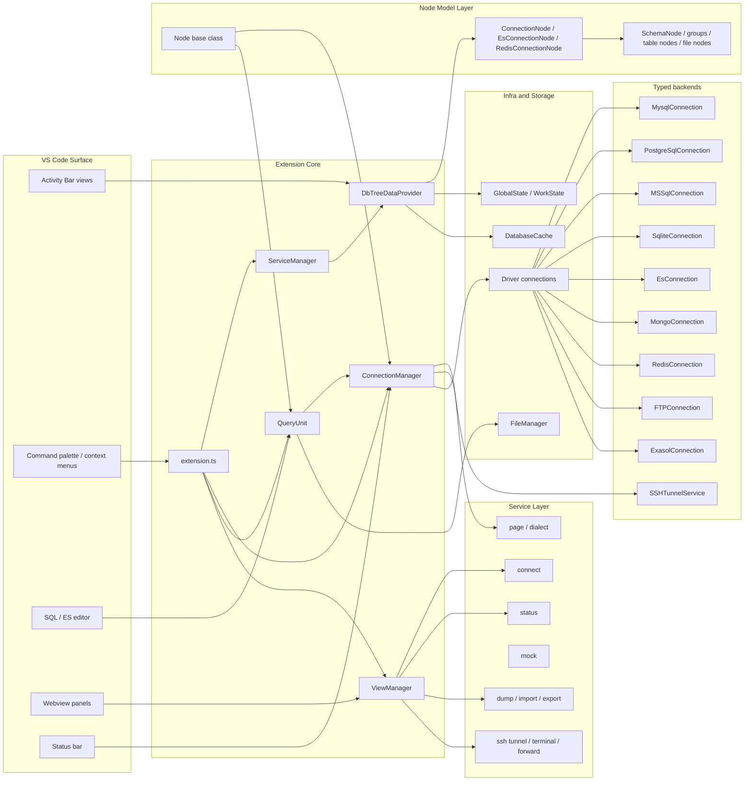
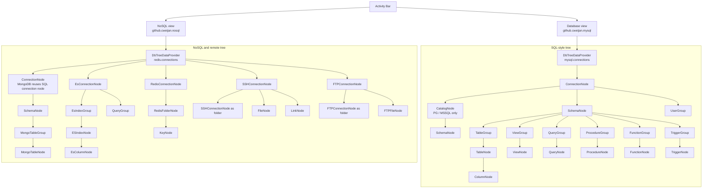
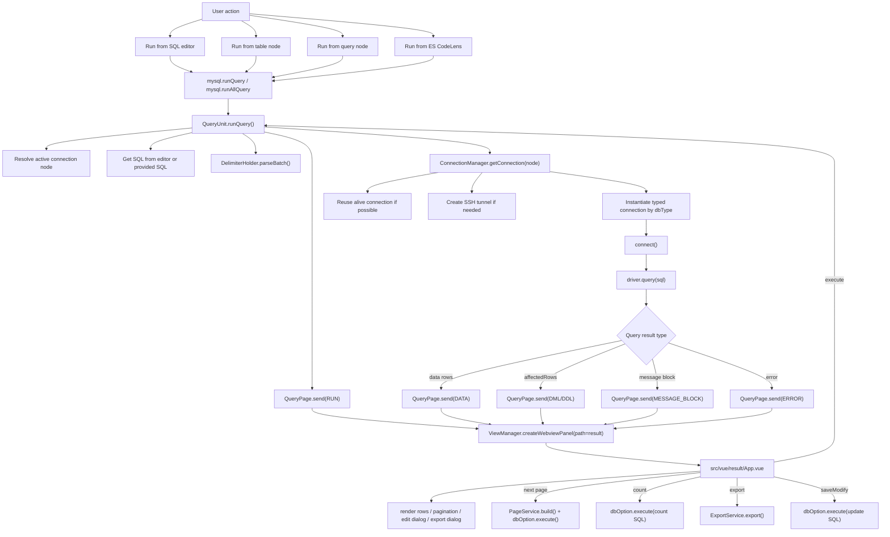
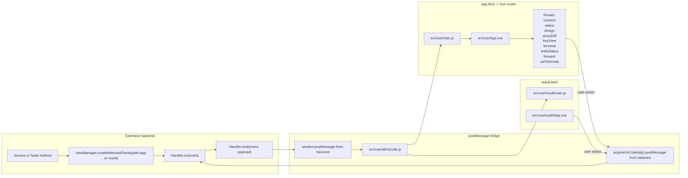
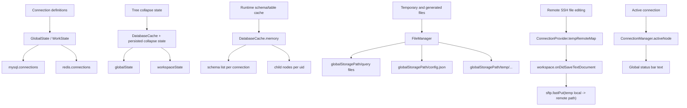
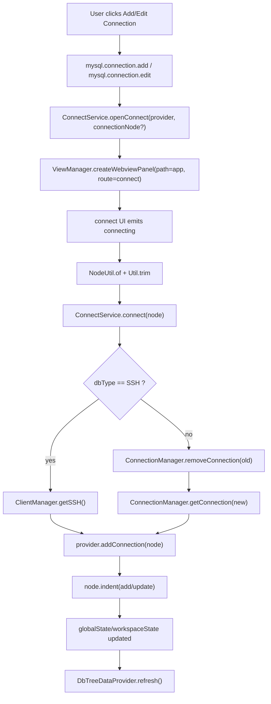

# Current Extension Diagrams

Doc nay giu vai tro quick overview.

## Related Docs

- [architecture.md](architecture.md): ban kien truc day du hon, co module boundaries va sequence diagram cho command quan trong.
- [deep-dive-query.md](deep-dive-query.md): di sau vao query pipeline.
- [deep-dive-tree-explorer.md](deep-dive-tree-explorer.md): di sau vao tree explorer, node identity, cache, refresh.
- [deep-dive-webview-app.md](deep-dive-webview-app.md): di sau vao `app.html`, `result.html`, `ViewManager`, va message bus.

Tai lieu nay tom tat kien truc hien tai cua extension theo code trong repo. Muc tieu la giup ban doc nhanh cac luong chinh, sau do di vao file code dung diem.

## Scope

- Entry point va activation
- Runtime architecture
- Tree explorer structure
- Query execution flow
- Webview routing and message bus
- State, cache, va file persistence

## Key Files

| File | Vai tro |
| --- | --- |
| [package.json](package.json) | activation events, views, commands, grammars, menus |
| [src/extension.ts](src/extension.ts) | entry point, command wiring |
| [src/service/serviceManager.ts](src/service/serviceManager.ts) | composition root cho services, language providers, tree views |
| [src/provider/treeDataProvider.ts](src/provider/treeDataProvider.ts) | tree provider cho `Database` va `NoSQL` views |
| [src/model/interface/node.ts](src/model/interface/node.ts) | base class cho almost all nodes, identity, execute, terminal |
| [src/service/connectionManager.ts](src/service/connectionManager.ts) | connection lifecycle, active node, SSH tunnel, typed connection creation |
| [src/service/queryUnit.ts](src/service/queryUnit.ts) | query execution from editor/table actions |
| [src/service/result/query.ts](src/service/result/query.ts) | adapt result va push vao result webview |
| [src/common/viewManager.ts](src/common/viewManager.ts) | generic webview creation, singleton page logic, message bridge |
| [src/service/connect/connectService.ts](src/service/connect/connectService.ts) | connect/edit config UI flow |
| [src/common/state.ts](src/common/state.ts) | wrapper cho `globalState` va `workspaceState` |
| [src/common/filesManager.ts](src/common/filesManager.ts) | query/config/temp file persistence trong `globalStoragePath` |
| [src/service/common/databaseCache.ts](src/service/common/databaseCache.ts) | memory cache cho schema tree va collapse state |
| [src/vue/main.js](src/vue/main.js) | Vue router cho `app.html` |
| [src/vue/result/main.js](src/vue/result/main.js) | Vue entry cho `result.html` |

## 1. Activation Overview

```mermaid
flowchart TD
    A["VS Code activation events<br/>package.json"] --> B["activate(context)<br/>src/extension.ts"]

    B --> C["new ServiceManager(context)"]
    C --> C1["Global.context = context"]
    C --> C2["DatabaseCache.initCache()"]
    C --> C3["ViewManager.initExtesnsionPath()"]
    C --> C4["FileManager.init()"]
    C --> C5["new ConnectionProvider()"]

    B --> D["activeEs(context)"]
    B --> E["ConnectionNode.init()"]
    B --> F["serviceManager.init()"]
    B --> G["ConnectService.listenConfig()"]
    B --> H["window.onDidChangeActiveTextEditor(detectActive)"]
    B --> I["initCommand(commandDefinition)"]

    F --> F1["register SQL formatting provider"]
    F --> F2["register SQL CodeLens provider"]
    F --> F3["register SQL document symbol provider"]
    F --> F4["register SQL hover provider"]
    F --> F5["register SQL completion provider"]
    F --> F6["create Database tree view"]
    F --> F7["create NoSQL tree view"]
    F --> F8["init settingService / statusService / mockRunner"]

    D --> D1["register ES completion provider"]
    D --> D2["register ES CodeLens provider"]
    D --> D3["register ES commands"]

    I --> I1["70 command handlers bound to services/nodes"]
    H --> H1["detectActive()"]
    H1 --> H2["ConnectionManager.changeActive(file node)"]
```

### Read This As

- `activate()` chi wiring va bootstrap.
- `ServiceManager` la composition root nho nhat cua runtime.
- `extension.ts` la noi tap trung gan command string vao methods tren node/service.

## 2. Runtime Architecture

### Main Idea

- Extension nay khong chi la syntax helper. No la mot ung dung nho ben trong VS Code.
- `Node` layer la domain + UI hybrid, vi `Node` ke thua `vscode.TreeItem`.
- `ViewManager` la bridge chung cho gan nhu toan bo webview pages.

## 3. Explorer Tree Structure

### Notes

- `DbTreeDataProvider.getNode()` quyet dinh serialized connection se hydrate thanh node class nao.
- MongoDB di vao `NoSQL` view, nhung van reuse `ConnectionNode` va `SchemaNode`.
- Tree data la lazy-loaded qua `getChildren()` tren tung node.

## 4. Query Execution Flow

### Important Details

- `QueryUnit` vua lo editor integration, vua lo query orchestration.
- `QueryPage` vua adapt result, vua la backend handler cho result webview.
- Result webview khong chi hien thi; no con goi nguoc lai backend de paging, export, save row edits.

## 5. Webview Routing and Message Bus

### Typical `app` Webview Pattern

1. Backend mo panel voi `path: "app"`.
2. Backend emit `route = connect` hoac `route = status`.
3. Vue router chuyen sang component tuong ung.
4. Component gui action lai backend bang `postMessage`.
5. Backend service xu ly va emit data/state tro lai.

### Typical `result` Webview Pattern

1. Backend mo panel voi `path: "result"`.
2. `QueryPage.send()` emit `RUN`, `DATA`, `ERROR`, ...
3. Result app cap nhat grid, toolbar, export, pagination, row edit state.

## 6. State, Cache, and Persistence

### What Lives Where

- Connection config song song ton tai trong `globalState` va `workspaceState`.
- Tree cache va child cache mostly la in-memory.
- Query/template/config files duoc ghi ra `context.globalStoragePath`.
- SSH remote edit dung local temp file, roi upload lai khi save.

## 7. Connect and Config Flow

## 8. Mental Model

Doc extension nay nhanh nhat theo thu tu sau:

1. [src/extension.ts](src/extension.ts)
2. [src/service/serviceManager.ts](src/service/serviceManager.ts)
3. [src/provider/treeDataProvider.ts](src/provider/treeDataProvider.ts)
4. [src/model/interface/node.ts](src/model/interface/node.ts)
5. [src/service/connectionManager.ts](src/service/connectionManager.ts)
6. [src/service/queryUnit.ts](src/service/queryUnit.ts)
7. [src/service/result/query.ts](src/service/result/query.ts)
8. [src/common/viewManager.ts](src/common/viewManager.ts)
9. [src/vue/main.js](src/vue/main.js) va [src/vue/result/App.vue](src/vue/result/App.vue)

## 9. Short Summary

- `extension.ts` la command registry.
- `ServiceManager` la bootstrap layer.
- `DbTreeDataProvider` + `Node` hierarchy la explorer app.
- `ConnectionManager` la session/runtime connection layer.
- `QueryUnit` + `QueryPage` la data execution layer.
- `ViewManager` + Vue apps la UI shell ben trong webview.
- `GlobalState`, `WorkState`, `DatabaseCache`, `FileManager` la persistence/cache layer.
